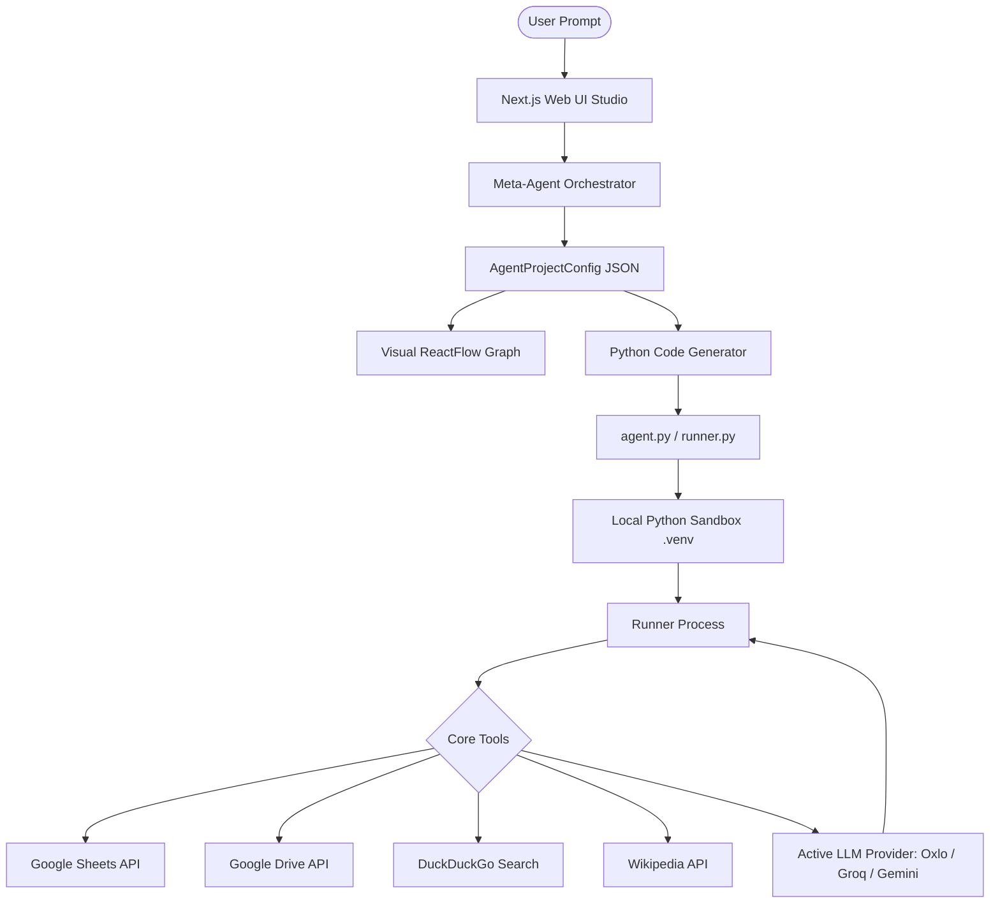

# 🛠️ MechaForge Lab

**MechaForge Lab** is a visual Meta-Agent builder and local execution studio. It empowers developers and workflow engineers to translate natural language descriptions into fully functional, production-ready AI agent architectures, visualize their structures, and execute them safely inside a local sandbox using real-world integrations.

---

## 🌟 Real-World Problem & Applications

### The Problem
Building multi-agent systems often requires writing boilerplate code, configuring complex orchestration frameworks (like LangChain or AutoGen), setting up local credentials, and manually wiring tool invocations. Bridging the gap between a visual prototype and a locally executable, authenticated script is slow and error-prone.

### The Solution
MechaForge Lab solves this by combining a **visual meta-agent compiler** with a **local Python execution sandbox**. You describe your objective in plain English, and the platform automatically generates, compiles, runs, and allows you to download a complete standalone Python package that executes under your local environment with real credentials.

### Target Users
*   **AI Developers & Prototypers** looking to quickly scaffold and test multi-agent setups.
*   **Workflow Engineers** automating tasks across search engines, Google Sheets, Drive, and email.
*   **Enthusiasts** exploring agentic workflows without getting bogged down in boilerplate code.

### ⚖️ Distinction from n8n & Workflow Automation Services
Unlike n8n, Make, or Zapier, which are deterministic flow charts where data runs linearly from pre-defined node A to node B:
* **Autonomous Reasoning vs. Pre-defined Rules:** MechaForge Lab builds agents that utilize LLM function calling (tool-use). The agent dynamically decides *which* tool to call, in *what* sequence, and *how* to handle outputs based on the situation, rather than executing a rigid, hardcoded flow.
* **Agentic Orchestration:** It compiles advanced ADK schemas (Sequential pipeline, Parallel branching, and Loop reiterations) where sub-agents can collaborate and transfer control back and forth.
* **Local, Standalone Code Generation:** Rather than locking you into a hosted workflow runtime, MechaForge Lab generates a **100% standalone, local Python package** with its own virtual environment loader (`runner.py`) that you can download and execute independently anywhere.

---

## 🏗️ System Architecture & Workflow

MechaForge Lab converts your natural language requirements into a structured JSON config, visualizes it as a graph, translates it into executable Python code, and runs it locally:



### Dynamic Execution Pipeline
1.  **Orchestration:** The frontend sends the user's builder prompt to the Meta-Agent Orchestrator (powered by Oxlo/DeepSeek, Groq, or Gemini).
2.  **Structural Visualizer:** The LLM returns an `AgentProjectConfig` JSON block that ReactFlow parses to render an interactive node graph.
3.  **Local Compilation:** The code generator writes a self-contained python agent bundle (`agent.py`, `runner.py`, `requirements.txt`, `.env`) directly to a local execution directory (`.agent_run`).
4.  **Sandbox Execution:** The backend runs the Python script inside a virtual environment (`.venv`), queries the selected LLM, and streams tool results and logs back to the web console.

---

## 💻 Tech Stack

*   **Core Frontend:** Next.js (React 19, TypeScript), TailwindCSS, Radix UI, Lucid Icons.
*   **Visualization:** ReactFlow (rendering node maps, parameters, instructions, and tools).
*   **Agent Sandbox Engine:** Local Python 3.9+ environment executing generated files via `child_process.spawn`.
*   **Active LLMs:** Integration with **Oxlo.ai (DeepSeek-V4/V3)**, **Groq (Llama 3)**, and **Google Gemini (Gemini 2.0/3.0)**.

---

## 🔧 Google ADK: Model-Agnostic Evolution

Originally built strictly around the Google Agent Development Kit (ADK) designed exclusively for Gemini models, MechaForge Lab modifies this schema into a **model-agnostic runtime**. 

*   **Unified OpenAI-Compatible Client:** The python runtime in the generated agent utilizes a wrapper that binds different API signatures (Groq, Gemini, Oxlo) into standard OpenAI SDK completions.
*   **Flexible Config Mapping:** System instructions, schemas, and completion parameters are dynamically normalized in the backend, allowing a Llama or DeepSeek model to plan and execute tasks with the same accuracy as a native Gemini model.

---

## 🔒 Security & Privacy

When you connect your Google Account, security is maintained through the following controls:

*   **Short-Lived Access Tokens:** Authorization is performed using OAuth 2.0. The app stores **only short-lived, ephemeral Google Access Tokens** inside cookie stores and session state. No long-term refresh tokens or client credentials (`credentials.json`) are stored or written to disk.
*   **Secure Environment Variables:** Tokens are fed directly to the spawned sandbox Python process using memory-isolated environment variables (`GOOGLE_ACCESS_TOKEN`), keeping them safe from log dumps.
*   **No Codebase Leakage:** The credential configuration file `frontend/lib/api-key.ts` is explicitly tracked with Git’s `--assume-unchanged` index flag. Your personal API keys and local secrets remain safe and are never pushed to public repositories.

---

## 🛠️ Sandbox Tools

MechaForge Lab provides six pre-authenticated, ready-to-use core tools:

| Category | Tool | Signature & Behavior |
| :--- | :--- | :--- |
| **Search** | `web_search` | Dynamically routes queries. Uses **DuckDuckGo** (primary for news/docs) or **Wikipedia** (primary for facts/definitions) with progressive fallback strings. No keys required. |
| **Scraper** | `scrape_web_page` | Fetches a URL and strips HTML tags, returning cleaned text. |
| **Google Sheets** | `read_google_sheet` | Reads cell ranges using the active Google access token. |
| **Google Sheets** | `append_to_google_sheet` | Appends data rows utilizing the user's active Google access token. |
| **Google Drive** | `list_drive_files` | Searches and lists documents in your connected Google Drive. |
| **Google Drive** | `upload_to_drive` | Uploads Markdown or plain-text files directly to Google Drive. |

---

## 🚀 Local Setup & Testing

### Prerequisites
*   **Node.js 18+**
*   **Python 3.9+** (ensure `python` is in your system PATH)

### 1. Launch the Studio
Navigate to the `frontend` folder and start the Next.js development server:
```bash
cd frontend
npm install
npm run dev
```
Open **`http://localhost:3000`** in your browser.

### 2. Configure Google Cloud Console Credentials (For Google Integration)
To enable Google login, Sheets, and Drive tools:
1.  Go to the [Google Cloud Console](https://console.cloud.google.com/).
2.  Create a project and enable these APIs: **Google Sheets API**, **Google Drive API**, **Gmail API**, **Google Calendar API**.
3.  Go to **APIs & Services > OAuth consent screen**, configure an external app, and add your email as a test user.
4.  Go to **Credentials > Create Credentials > OAuth client ID**:
    *   **Application type:** Web application
    *   **Authorized JavaScript origins:** `http://localhost:3000`
    *   **Authorized redirect URIs:** `http://localhost:3000/api/auth/callback/google`
5.  Copy your **Client ID** and **Client Secret**, and paste them into your local `frontend/.env.local`:
    ```env
    NEXT_PUBLIC_BASE_URL=http://localhost:3000
    GOOGLE_CLIENT_ID=your_client_id_here
    GOOGLE_CLIENT_SECRET=your_client_secret_here
    ```
6.  Restart the dev server (`npm run dev`) to apply the configuration.

### 3. Verification Prompts

#### Agent Creation Prompt
Enter this in the prompt box on the landing page to build the workspace:
```text
Create an agent that can read and write data to Google Sheets and upload text or markdown files to Google Drive.
```

#### Tool Action Prompt
Once generated, click **`🔐 Connect Google Account`** in the top header, toggle to **Live (Python)** mode in the chat interface, and run this execution command:
```text
Write the values ["Test Row", "Testing Google Sheets Tool", "Success"] to the spreadsheet 1TTrBCX9GpQ99WG9E1jJJFPXctTGL0R3eXmAWXnORQLA under range Sheet1!A1:C1. Then, upload a text file named "test_connection.txt" with the content "Google API integration is fully functional!" to Google Drive.
```
